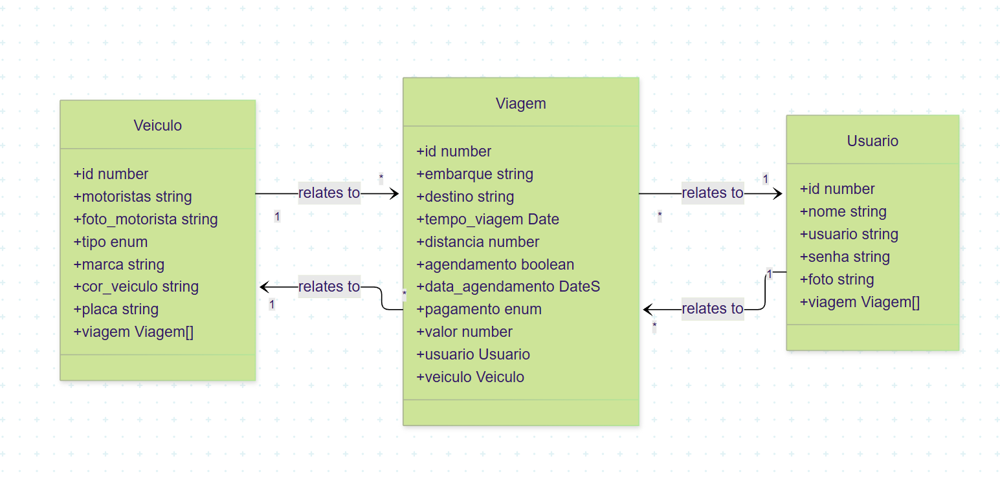

# Carona Compartilhada Backend\n\n\n\n

## Visão Geral

API backend para sistema de caronas compartilhadas desenvolvido com **NestJS**, **TypeScript**, **TypeORM** e **PostgreSQL** (Neon). Implementa autenticação segura com JWT e BCrypt, documentação Swagger protegida por autenticação e relacionamentos bidirecionais entre entidades.

## Stack Tecnológica

- **Framework**: NestJS
- **Linguagem**: TypeScript
- **ORM**: TypeORM
- **Banco**: PostgreSQL (Neon)
- **Autenticação**: JWT + BCrypt
- **Documentação**: Swagger (protegida)
- **Deploy**: Render

## Funcionalidades Principais

- Autenticação e autorização JWT
- CRUD completo para Usuários, Veículos e Viagens
- Relacionamentos bidirecionais (Usuário-Viagem-Veículo)\n\n\n
- Cálculo automático de tempo de viagem baseado em distância e velocidade média
- Documentação API protegida por autenticação Bearer

## Decisões de Engenharia

### Atributo 'usuario' vs 'email'
Mantido o atributo `usuario` em vez de `email` nas entidades para maior **compatibilidade de segurança**. Permite flexibilidade na autenticação (username, email ou telefone) mantendo um identificador único estável para relacionamentos.

### Omissão do método DELETE de Usuários\nRemovido intencionalmente para preservar **integridade referencial**. Usuários possuem relacionamentos bidirecionais com Viagens e Veículos. Soft delete ou anonimização devem ser implementados em produção.\n\n## Diagrama de Relacionamentos\n\n\n\n## Funcionalidades de Negócio

### Cálculo de Tempo de Viagem
Método especializado que calcula tempo estimado baseado em:
```
tempo = distancia / velocidade_media
```
Onde `velocidade_media = 50 km/h` (padrão urbano) com ajustes por condições de tráfego.

## Instalação

```bash
npm install
cp .env.example .env
npm run start:dev
```

## Deploy (Render)

1. Conectar repositório GitHub
2. Configurar variáveis de ambiente (DATABASE_URL, JWT_SECRET)
3. Build command: `npm run build`
4. Start command: `npm run start:prod`

## Desenvolvedores
| Nome | GitHub | LinkedIn |
|------|--------|----------|
| Sabrina Novaes | [GitHub](https://github.com/SabrinaNovaes) | [LinkedIn](https://www.linkedin.com/in/sabrina-novaes/) |
| Bianca Caetano | [GitHub](https://github.com/bia024) | [LinkedIn](http://www.linkedin.com/in/bia-caetano) |
| Clarisse Rodrigues | [GitHub](https://github.com/clarodriguess) | [LinkedIn](https://www.linkedin.com/in/clarissee-rodriguess/) |
| Leonardo Botelho | [GitHub](https://github.com/Botelhool) | [LinkedIn](https://www.linkedin.com/in/leonardo-botelho-b29061174/) |

## Tester
| Nome | GitHub | LinkedIn |
|------|--------|----------|
| Gabriela Almeida | [GitHub](https://github.com/Gaalmeida-dev) | [LinkedIn](https://www.linkedin.com/in/gabriela-almeida-escalera-dos-santos-27022b3a0/) |

## Apresentação
| Nome | GitHub | LinkedIn |
|------|--------|----------|
| Nathalia Scalercio | [GitHub](https://github.com/nathscalercio) | [LinkedIn](http://linkedin.com/in/nathalia-scalercio/) |

## Scrum Master
| Nome | GitHub | LinkedIn |
|------|--------|----------|
| Ramon Alberto | [GitHub](https://github.com/RAMONBRX) | [LinkedIn](https://www.linkedin.com/in/ramon-alberto/) |

## Endpoints Swagger
Acessível em `/api` após autenticação JWT.

